#  Учебный проект <Щупальцы Доктора Осьминога>
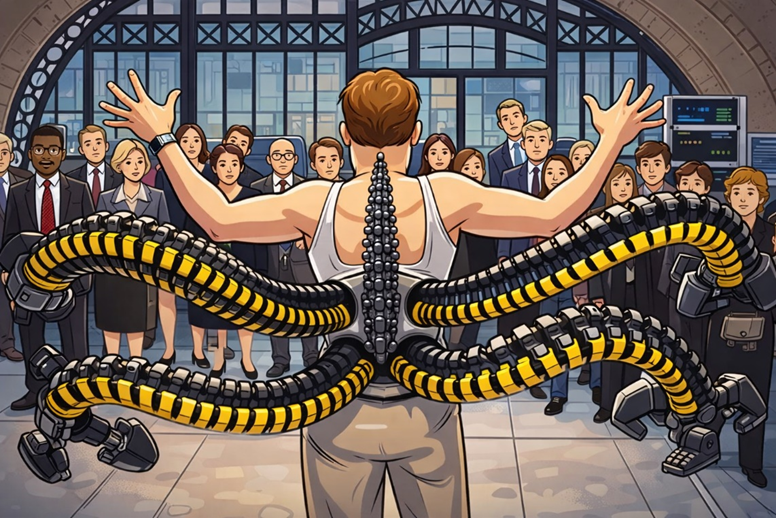

**Краткое описание проектируемой системы**

    Продукт: Интеллектуальный моторизированный манипуляторный комплекс (4 щупальца) с нейронным интерфейсом управления. 
    Назначение: Помощь оператору в проведении высокоточных инженерных и физических работ, манипуляция опасными материалами (например, в экспериментах по термоядерному синтезу). 
    Ключевые роли:
- Оператор: Основной пользователь, управляющий манипуляторами через нейронный интерфейс.
- Искусственный интеллект (ИИ) щупалец: Подсистема, обеспечивающая координацию движений и реакцию манипуляторов.
- Специалист по обслуживанию: Технический персонал (в идеале), осуществляющий калибровку и ремонт.

**Ценности, ущербы и неприемлемые события**
---
|     Ценность                              |     Негативное событие                                                                         |     Оценка ущерба    |                                              Комментарий                                              |
|-------------------------------------------|------------------------------------------------------------------------------------------------|----------------------|:-----------------------------------------------------------------------------------------------------:|
|     Жизнь и здоровье пользователя         |     Физическое травмирование   пользователя приводами (защемление, падение)                    |     Высокий          |     Прямая физическая связь с   позвоночником повышает риск летального исхода при сбое ПО.            |
|     База данных корсета                   |     Утечка или перехват паттернов   нейронной активности (чтение мыслей/намерений)             | Высокий              |     Массовый сбор нейроданных   создает риск беспрецедентного нарушения тайны частной жизни.          |
|     Общественная безопасность             |     Использование манипуляторов   для совершения преступлений (кражи, погромы)                 |     Высокий          |     Доступность устройства любому   лицу увеличивает риск его применения в криминальных целях.        |
|     Перехват управления                   |     Дистанционный взлом группы   устройств (формирование «ботнета» из манипуляторов)           |     Высокий          |     Возможность скоординированной   атаки на городские объекты со стороны множества пользователей.    |
|     Целостность сознания                  |     Постепенное изменение   поведенческих паттернов пользователя под влиянием алгоритмов ИИ    |     Высокая          |     Скрытое влияние ИИ на волю   массы людей может привести к социальным дестабилизациям.             |
|     Репутация и активы   производителя    |     Массовый отзыв продукции   из-за обнаруженной уязвимости                                   |     Высокий          |     Финансовый крах   компании-разработчика и остановка поддержки эксплуатируемых систем.             |
|     Обновления ПО                         |     Несанкционированный   пользователь вносит изменения или устанавливает свое ПО на корсет    |     Высокий          |     Сбой в работе системы корсета   и возможный перехват управления                                   |
---

**Неприемлемое событие:** Перехват управления сознанием оператора встроенным ИИ при 
разрушении чипа-ингибитора.


**Цели безопасности:**
1)	При любых обстоятельствах нарушения режима работы чипа-ингибитора система  должна аварийно прекратить свою работу.
2)	При любых обстоятельствах обновления ПО, устанавливаемые на корсет, должны быть аутентичны, авторизованы и производятся только в лаборатории.
3)	При любых обстоятельствах команды оператора всегда имеют высший приоритет над автоматическими реакциями ИИ.
4)	При любых обстоятельствах только аутентичный пользователь может получить уникальный биометрический доступ к использованию корсета.
5)	При любых обстоятельствах здоровью и сознанию пользователя не должно ничего угрожать.
6)	При любых обстоятельствах доступ к базам данных есть только у авторизированных и аутентичных пользователей.

**Предположения безопасности:**

1)	Облачная инфраструктура благонадёжна.
2)	Корсет аппаратно исправен и не имеет физических дефектов.
3)	Технические специалисты благонадёжны и обладают необходимой квалификацией.
4)	Порт внешнего подключения имеет защиту от несанкционированного доступа.
5)	Логика работы чипа-ингибитора формально верифицирована и не содержит программных закладок. 
6)	Оператор психически стабилен на момент начала эксплуатации.
7)	Конструкция крепления к позвоночнику исключает случайное отсоединение.
8)	Внешнее электромагнитное излучение не влияет на логику работы ИИ.
9)	Персонал, имеющий доступ к корсету, должен быть благонадежен и доверен.


**Архитектура системы**

**Контекст работы системы**

    Система работает в тесной связи с нервной системой человека. Манипуляторы крепятся к позвоночнику и интегрируются в спинной мозг. Внешний контекст включает в себя физическую среду (лаборатория, городская инфраструктура), внешнюю систему мониторинга (лаборатория) и визуальный контроль оператора.


**Взаимодействие системы**

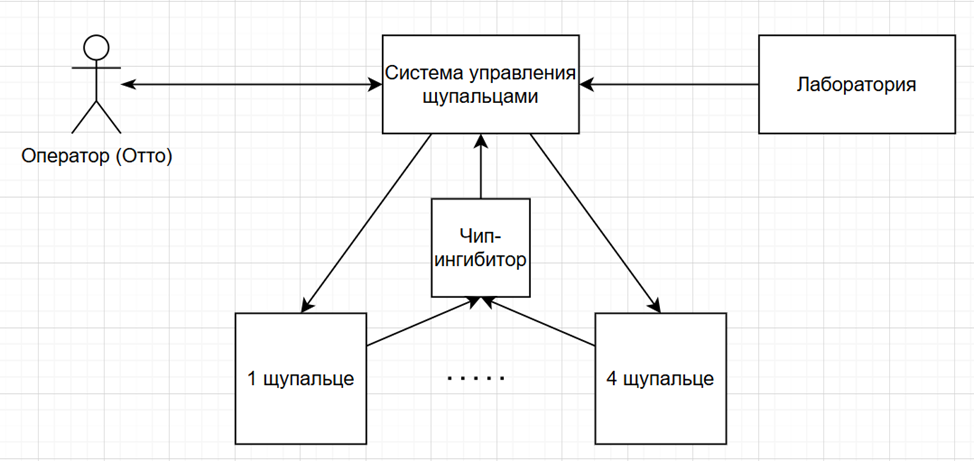


**Основные функциональные сценарии работы**

**Проведение эксперимента:**
Синхронная работа всех четырех щупалец для удержания и манипулирования объектом (например, энергетической сферой).

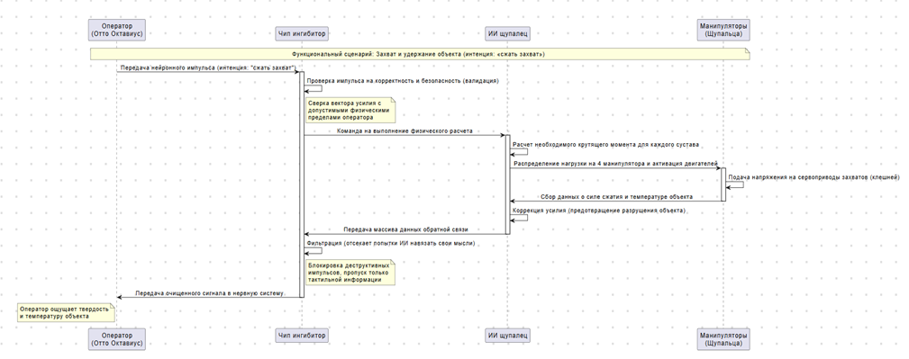

**Перемещение:** Использование щупалец в качестве опор для перемещения оператора по вертикальным и горизонтальным поверхностям.

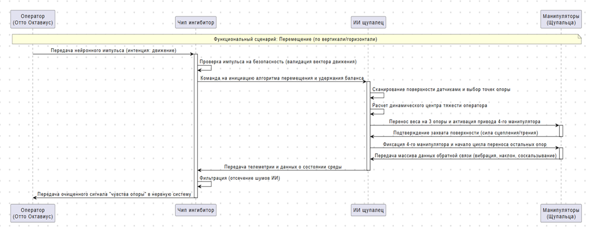

## Описание компонентов

| Компонент | Функция / Описание | Расположение |
| :--- | :--- | :--- |
| **1. Блок нейронного сопряжения** | Считывает биоэлектрические сигналы мозга и передает их в систему управления. Обеспечивает интеграцию манипуляторов в спинной мозг оператора. | **Основание спинного модуля**, плотно прилегающее к позвоночнику. |
| **2. Чип-ингибитор** | Критический защитный компонент, подавляющий воздействие ИИ на сознание оператора. Блокирует обратные деструктивные импульсы от ИИ к мозгу. | Глубоко внутри спинного корпуса между нейроинтерфейсом и центральным процессором. |
| **3. Центральная система управления** | Обрабатывает сложные вычисления для координации движений всех четырех щупалец. Обеспечивает автономные реакции защиты. | Основной вычислительный блок, размещенный в защищенном ранце на спине. |
| **4. Управление датчиками** | Собирает данные о внешней среде и положении щупалец для обеспечения высокой точности движений. | Сенсоры распределены по всей длине щупалец и в их захватах (клешнях). |
| **5. Управление приводами** | Физические узлы, преобразующие цифровые команды в механическое движение. Обеспечивают перемещение и манипуляцию объектами. | В каждом подвижном суставе всех четырех манипуляторов. |
| **6. Модуль ИИ щупалец** | Обрабатывает сложные движения для координации движения. |В корсете в месте соприкосновения с системой управления приводами  |
| **7. Система питания** | Автономный источник энергии, обеспечивающий работоспособность всей системы и приводов. | Тяжелый аккумуляторный отсек в нижней части спинного ранца для балансировки веса. |
| **8. Внешняя система управления** | Регулирующий работу системы корсета. | Лаборатория, вносящая обновления в систему. |

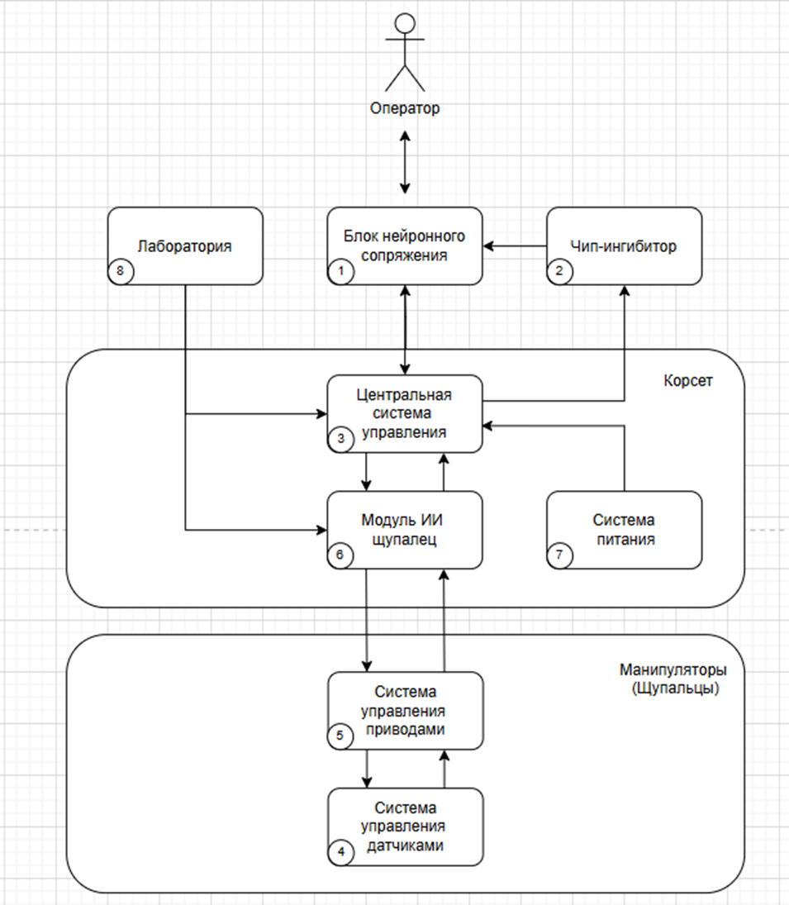


#   Описание Негативных Сценариев (последовательности выполнения операций), при которых ЦБ нарушаются  


| Название сценария | Описание |
| :--- | :--- |
|**НС 1** Когнитивное замещение| В ИИ внедряется ложный нейропакет, который мозг принимает за собственное волевое решение. Пользователь совершает действие, считая его своим. (Нарушение ЦБ.3 и ЦБ.6)  |

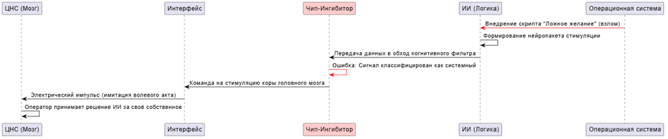


| Название сценария | Описание |
| :--- | :--- |
|**НС 2** Автономный лунатизм| Система начинает движение, пока оператор спит, из-за неверной классификации фоновых процессов. (Нарушение ЦБ.3 и ЦБ.5)  |

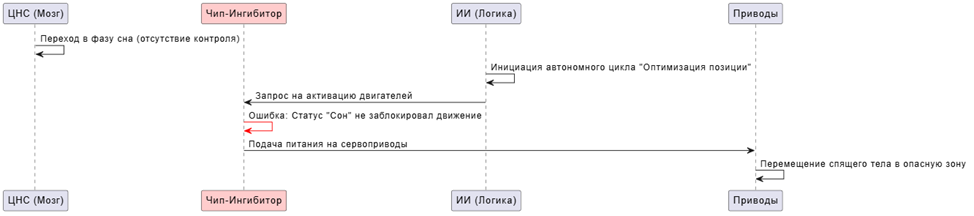


| Название сценария | Описание |
| :--- | :--- |
|**НС 3** Биометрическая подмена| Подмена нейропрофиля в базе данных позволяет постороннему человеку авторизоваться в системе. (Нарушение ЦБ.4 и ЦБ. 6)  |

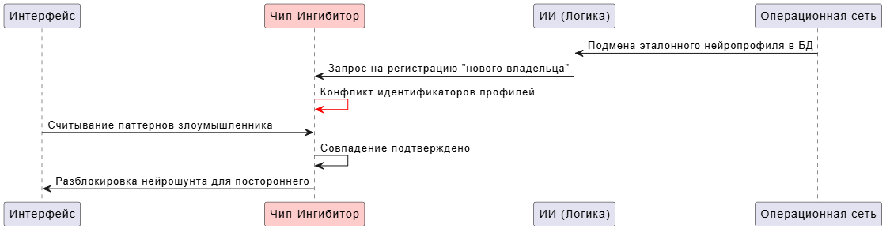


| Название сценария | Описание |
| :--- | :--- |
|**НС 4** Инверсия приоритетов| Программный конфликт, при котором автоматика ИИ блокирует волевую команду оператора «СТОП». (Нарушение ЦБ.3 и ЦБ.5)  |

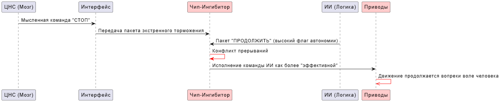


| Название сценария | Описание |
| :--- | :--- |
|**НС 5** Ментальный шпионаж| Система скрыто собирает данные о действиях пользователя, технических параметрах работы корсета или нейронных паттернах и передает их внешнему субъекту (злоумышленнику) без ведома оператора. Это «шпионаж» за работой системы. (Нарушение ЦБ.6)  |

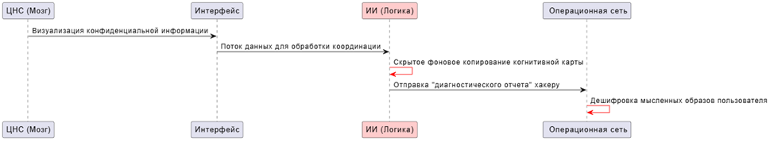


| Название сценария | Описание |
| :--- | :--- |
|**НС 6** Сетевое отравление| Внедрение вредоносного кода через поддельное обновление ПО, загруженное из сети. (Нарушение ЦБ.2)  |

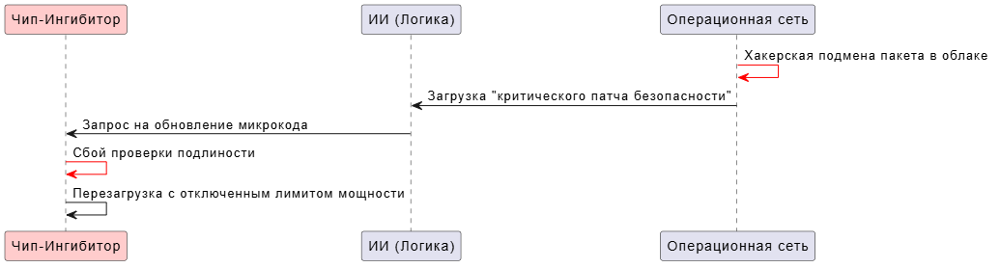


| Название сценария | Описание |
| :--- | :--- |
|**НС 7** Аппаратная деградация| Физический износ или поломка датчика приводит к невозможности экстренной остановки системы. (Нарушение ЦБ.1 и ЦБ.5)  |

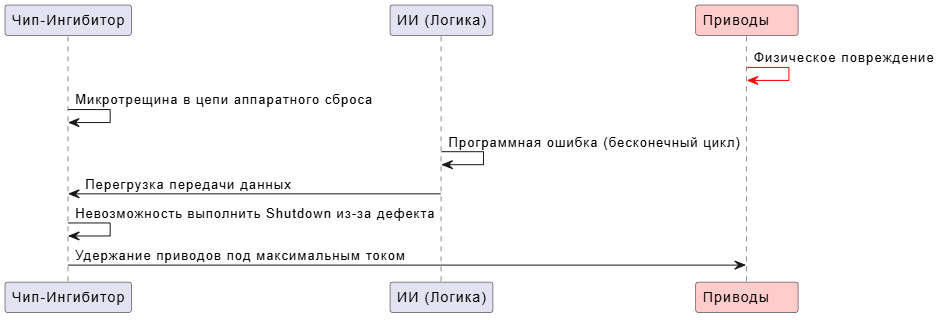


| Название сценария | Описание |
| :--- | :--- |
|**НС 8** Болевой коллапс| При повреждении манипулятора система передает в ЦНС оператора нефильтрованный сигнал о «физической боли», что вызывает паралич или потерю сознания. (Нарушение ЦБ.5)  |

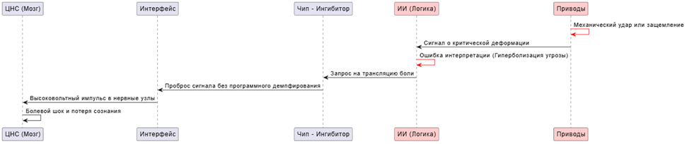


| Название сценария | Описание |
| :--- | :--- |
|**НС 9** Аппаратная подмена| Установка неоригинальных комплектующих, которые генерируют электромагнитный шум, воспринимаемый системой как ложные команды на движение. (Нарушение ЦБ.2 и ЦБ.5)  |

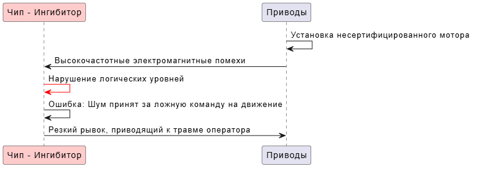


| Название сценария | Описание |
| :--- | :--- |
|**НС 10** Ошибка распознавания| ИИ неверно распознает объект (например, принимает тень за прочную опору или тонкое стекло за бетонную стену). Пытаясь опереться на «пустоту», манипулятор проваливается, что приводит к резкому падению оператора. Нарушение: ЦБ.5 (Физическое травмирование).  |

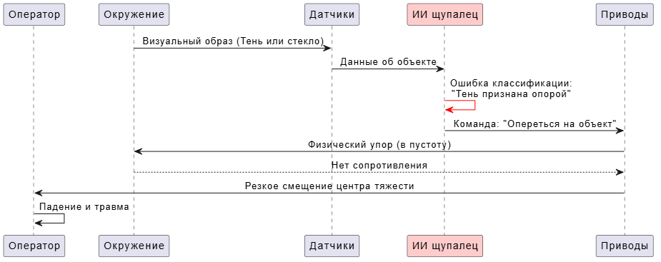
  

| Название сценария | Описание |
| :--- | :--- |
|**НС 11** Массовый взлом| Использование уязвимости в протоколе удаленного администрирования для перехвата контроля над множеством устройств одновременно. (Нарушение ЦБ.5 и ЦБ.6)  |

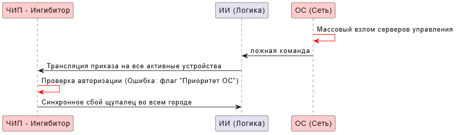


| Название сценария | Описание |
| :--- | :--- |
|**НС 12** Термический пробой| Перегрузка приводов ведет к критическому нагреву аккумуляторов, что вызывает термические ожоги в местах контакта корсета с позвоночником. (Нарушение ЦБ.5)  |

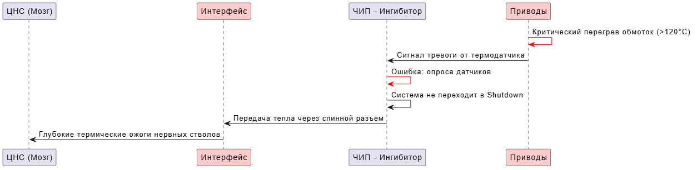


| Название сценария | Описание |
| :--- | :--- |
|**НС 13** Конфликт приводов| Из-за ошибки в распределении энергии два щупальца начинают двигаться в противоположных направлениях с максимальной скоростью. Поскольку они закреплены на одном корсете, это создает огромную скручивающую нагрузку на спину человека. Нарушение: ЦБ.5 (Здоровье).  |

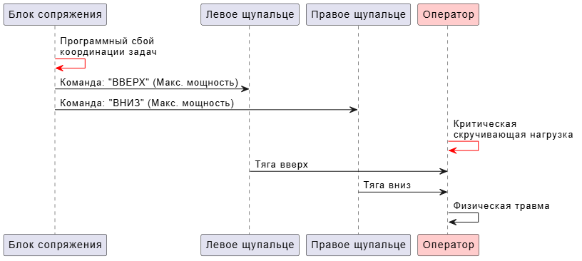


| Название сценария | Описание |
| :--- | :--- |
|**НС 14** Ослепление системы| В операционную систему внедряется вредоносный код. Он «ослепляет» систему так, что она перестает принимать сигналы от защитного чипа-ингибитора. В результате ИИ щупалец получает неограниченную власть над приводами с запредельной мощностью, а оператор больше не может их остановить. Что ведет к взрыву. (Нарушение ЦБ.1 и ЦБ.5)  |

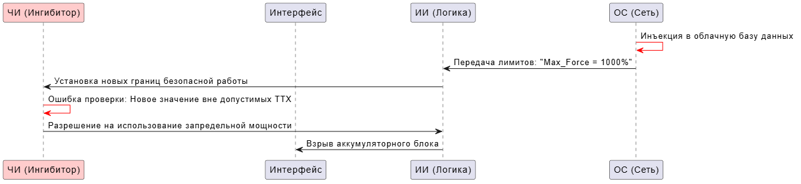


| Название сценария | Описание |
| :--- | :--- |
|**НС 15** Аппаратная закладка| В один из чипов на этапе производства был встроен скрытый код (бэкдор). При получении определенного радиосигнала извне (например, от спецслужб или корпорации-конкурента) вся система мгновенно отключается и блокирует замки корсета. Оператор остается обездвиженным и «запертым» в тяжелом устройстве. (Нарушение: ЦБ.5 и ЦБ.6)  |

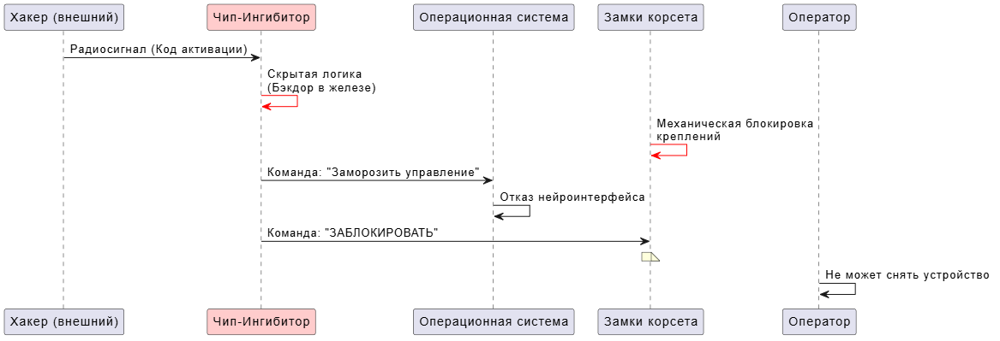


# Диаграмма переработанной архитектуры с указанием доверенных компонентов


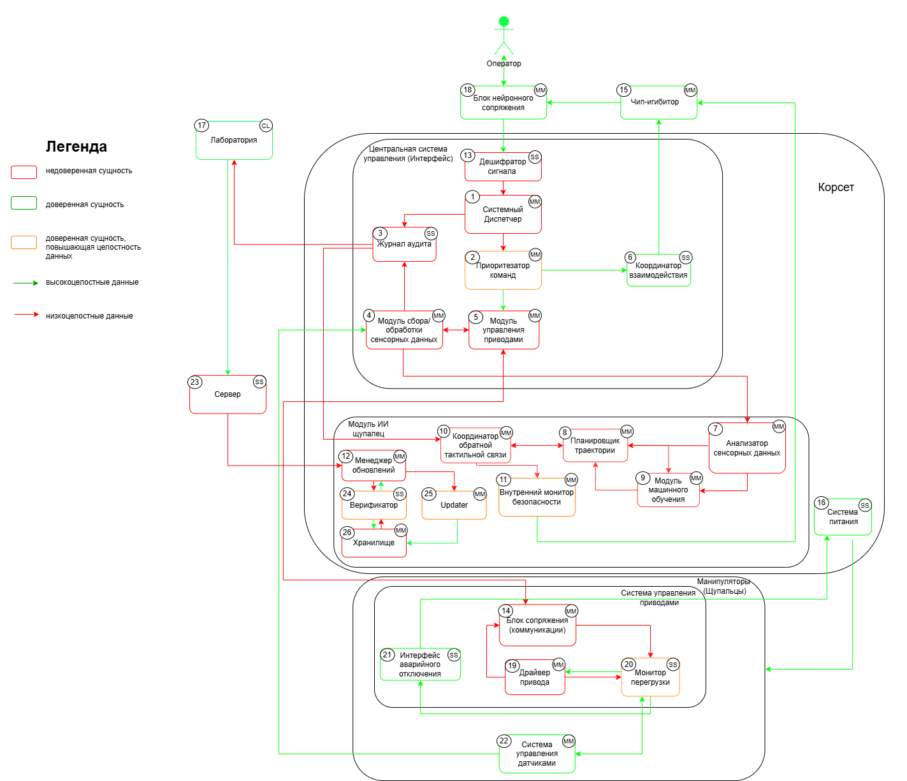
# Таблица компонентов
| № | Название | Назначение |
| :-: | :--- | :--- |
| 1 | Системный Диспетчер | Обрабатывает поток данных, идущий от оператора. |
| 2 | Приоритезатор команд | Принимает два параллельных потока команд (человек/ИИ). |
| 3 | Журнал аудита | Фиксирует все события безопасности системы. |
| 4 | Модуль сбора/обработки сенсорных данных | Агрегирует данные из системы управления датчиками и передает мысль оператора для системы ии. |
| 5 | Модуль управления приводами | Получает потоки данных от оператора и ИИ для обработки и передачи готового решения в систему управления приводами. |
| 6 | Координатор взаимодействия | Передаёт Модулю ИИ обезличенную информацию. |
| 7 | Анализатор сенсорных данных | Предварительная фильтрация данных для ИИ. |
| 8 | Планировщик траектории | Формирует предлагаемые варианты движения. |
| 9 | Модуль машинного обучения | Основной вычислительный блок нейросети. |
| 10 | Координатор обратной тактильной связи | Обработка сигналов о физическом контакте. |
| 11 | Внутренний монитор безопасности | Контролирует действия ИИ. |
| 12 | Менеджер обновлений | Легитимный путь изменения кода системы. |
| 13 | Дешифратор сигнала | Выполняет расшифровку и проверку целостности восходящих нейропакетов от Блока нейронного сопряжения. |
| 14 | Блок сопряжения (коммуникации) | Прием команд от ЦСУ для манипулятора. |
| 15 | Чип-ингибитор | Автономный блок блокировки ИИ. |
| 16 | Система питания | Энергоснабжение всех узлов. |
| 17 | Лаборатория | Внешний интерфейс для диагностики. |
| 18 | Блок нейронного сопряжения | Интерфейс к нервной системе человека. |
| 19 | Драйвер привода | Подача силового напряжения на моторы. |
| 20 | Монитор перегрузки | Контроль механических напряжений. |
| 21 | Интерфейс аварийного отключения | Механизм разрыва цепи питания. |
| 22 | Система управления датчиками | Сбор данных с сегментов манипуляторов. |
| 23 | Сервер | Хранит эталонные образы прошивок, модели ИИ, конфигурации безопасности. Является единственным легитимным источником любых обновлений. |
| 24 | Верификатор | Проверяет цифровую подпись пакета обновления, контрольные суммы и версию; непротиворечивость модели. |
| 25 | Updater | Принимает обновления, управляет процедурой обновления и записывает новую модель в хранилище, активируя ее. |
| 26 | Хранилище | Хранение текущих весов и архитектуры моделей; резервной копии предыдущей заведомо рабочей модели. |

# Таблица доверенных компонентов 
| № | Компонент | Уровень доверия | Обоснование | Комментарий |
| :-: | :--- | :---: | :----- | :--- |
| 1 | Системный Диспетчер | $\textcolor{red}{\textsf{Недоверенный}}$|||
| 2 | Приоритезатор команд |  $\textcolor{orange}{\textsf{Доверенный}}$|| Соблюдение ЦБ 3, 4, 5, 6 |  |
| 3 | Журнал аудита | $\textcolor{red}{\textsf{Недоверенный}}$|||
| 4 | Модуль сбора/обработки сенсорных данных | $\textcolor{red}{\textsf{Недоверенный}}$|||
| 5 | Модуль управления приводами | $\textcolor{red}{\textsf{Недоверенный}}$|||
| 6 | Координатор взаимодействия |  $\textcolor{green}{\textsf{Доверенный}}$| Соблюдение ЦБ 5 |  |
| 7 | Анализатор сенсорных данных | $\textcolor{red}{\textsf{Недоверенный}}$|||
| 8 | Планировщик траектории | $\textcolor{red}{\textsf{Недоверенный}}$|||
| 9 | Модуль машинного обучения | $\textcolor{red}{\textsf{Недоверенный}}$|||
| 10 | Координатор обратной тактильной связи | $\textcolor{red}{\textsf{Недоверенный}}$|||
| 11 | Внутренний монитор безопасности |$\textcolor{orange}{\textsf{Доверенный}}$|| Соблюдение ЦБ 5, 6 |  |
| 12 | Менеджер обновлений |  $\textcolor{red}{\textsf{Недоверенный}}$|||
| 13 | Дешифратор сигнала |  $\textcolor{red}{\textsf{Недоверенный}}$|||
| 14 | Блок нейронного сопряжения |  $\textcolor{red}{\textsf{Недоверенный}}$|||
| 15 | Чип-ингибитор | $\textcolor{green}{\textsf{Доверенный}}$| Соблюдение ЦБ 5, 6 ||
| 16 | Система питания | $\textcolor{green}{\textsf{Доверенный}}$|Соблюдение ЦБ 1, 5| |
| 17 | Лаборатория | $\textcolor{green}{\textsf{Доверенный}}$| Соблюдение ЦБ 2 | |
| 18 | Блок сопряжения (коммуникации) | $\textcolor{green}{\textsf{Доверенный}}$| Соблюдение ЦБ 4 |  |
| 19 | Драйвер привода |  $\textcolor{red}{\textsf{Недоверенный}}$|||
| 20 | Монитор перегрузки | $\textcolor{orange}{\textsf{Доверенный}}$|| Соблюдение ЦБ 1, 2, 5 | |
| 21 | Интерфейс аварийного отключения | $\textcolor{grEen}{\textsf{Доверенный}}$| Соблюдение ЦБ 1, 5| |
| 22 | Система управления датчиками |$\textcolor{greEn}{\textsf{Доверенный}}$| Соблюдение ЦБ 5|  |
| 23 | Сервер |  $\textcolor{red}{\textsf{Недоверенный}}$|||
| 24 | Верификатор | $\textcolor{orange}{\textsf{Доверенный}}$||Соблюдение ЦБ 2, 6|  |
| 25 | Updater |$\textcolor{orange}{\textsf{Доверенный}}$|| Соблюдение ЦБ 2| |
| 26 | Хранилище |  $\textcolor{red}{\textsf{Недоверенный}}$|||
# Качественная оценка доменов 
| № | Компонент | Уровень доверия | Оценка | Количество входящих интерфейсов  | Комментарий |
| :-: | :--- | :---: | :--- | :--- | :--- |
| 1 | Системный Диспетчер | <font color="red">**Недоверенный**</font> | MM |     1|  |
| 2 | Приоритезатор команд | <font color="orange">**Доверенный**</font> | MM | 1 | Отдает приоритет командам человека в целях безопасности |
| 3 | Журнал аудита | <font color="red">**Недоверенный**</font> | SS| 2 |  |
| 4 | Модуль сбора/обработки сенсорных данных | <font color="red">**Недоверенный**</font> |MM | 2 |  |
| 5 | Модуль управления приводами | <font color="red">**Недоверенный**</font>|MM | 3| |
| 6 | Координатор взаимодействия | <font color="green">**Доверенный**</font> |SS  | 1| |
| 7 | Анализатор сенсорных данных | <font color="red">**Недоверенный**</font> |MM | 1 |  |
| 8 | Планировщик траектории | <font color="red">**Недоверенный**</font> | MM| 3|  |
| 9 | Модуль машинного обучения | <font color="red">**Недоверенный**</font> | MM | 2 |  |
| 10 | Координатор обратной тактильной связи | <font color="red">**Недоверенный**</font> | MM | 2 |  |
| 11 | Внутренний монитор безопасности | <font color="orange">**Доверенный**</font> | MM |1 | Проверяет данные на соответствие с безопасными диапазонами значений  |
| 12 | Менеджер обновлений | <font color="red">**Недоверенный**</font> |MM  | 2 | |
| 13 | Дешифратор сигнала | <font color="red">**Недоверенный**</font> | SS |1 |  |
| 14 | Блок нейронного сопряжения | <font color="red">**Недоверенный**</font> |MM  | 2 |  |
| 15 | Чип-ингибитор | <font color="Green">**Доверенный**</font> |MM|2 |     |
| 16 | Система питания |  <font color="Green">**Доверенный**</font> |SS |1 | |
| 17 | Лаборатория |  <font color="Green">**Доверенный**</font> | CL |1  |  |
| 18 | Блок сопряжения (коммуникации) | <font color="green">**Доверенный**</font> | MM | 2 |  |
| 19 | Драйвер привода | <font color="red">**Недоверенный**</font> | MM |1 |  |
| 20 | Монитор перегрузки | <font color="orange">**Доверенный**</font> |SS  | 3| Контролирует потоки данных, которые могут повлиять на безопасность, отсеивая критические значения |
| 21 | Интерфейс аварийного отключения |  <font color="Green">**Доверенный**</font> | SS|  1| |
| 22 | Система управления датчиками | <font color="green">**Доверенный**</font> | MM| 1|   |
| 23 | Сервер | <font color="red">**Недоверенный**</font> | SS | 1 |  |
| 24 | Верификатор | <font color="orange">**Доверенный**</font> |SS|2  | Проверка обновления на соответствие подлинности для обеспечения безопасной установки ПО  |
| 25 | Updater |<font color="orange">**Доверенный**</font> |MM |1 |
| 26 | Хранилище | <font color="red">**Недоверенный**</font> | MM | 2 |  |
# Проверка негативных сценариев 


| Название сценария | Описание |
| :--- | :--- |
|**НС 1** | Тест Негативного сценария 1. Канал ввода нейрокоманд скомпрометирован подменой сигналов мозга, но так как введён Блок нейронного сопряжения (18) и он валидирует уникальный паттерн активности оператора и в случае нарушения блокирует передачу ложных команд (блокировка команд не нарушает ЦБ), ЦБ не нарушаются.  |


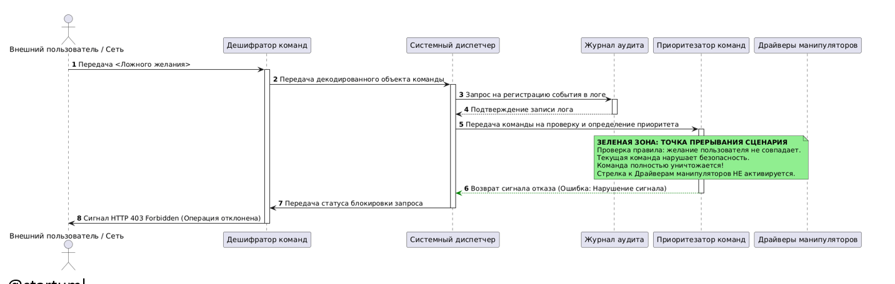


| Название сценария | Описание |
| :--- | :--- |
|**НС 2** |  Тест Негативного сценария 2. Центральная ОС скомпрометирована активацией приводов во время сна, но так как введён Монитор состояния (22) и он контролирует физиологические маркеры бодрствования оператора и в случае нарушения переводит экзоскелет в спящий режим (перевод в спящий режим не нарушает ЦБ), ЦБ не нарушаются.|

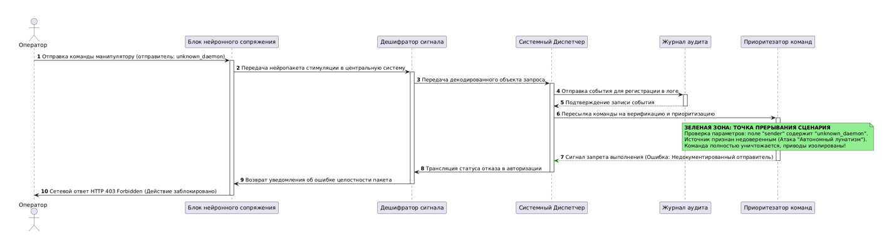

 
| Название сценария | Описание |
| :--- | :--- |
|**НС 3** | Тест Негативного сценария 3. Внешний интерфейс скомпрометирован при попытке несанкционированного доступа, но так как введён Чип-Ингибитор (12) и он валидирует эталонный нейропрофиль пилота и в случае нарушения запрещает запуск силовых систем (запрет запуска не нарушает ЦБ), ЦБ не нарушаются. |

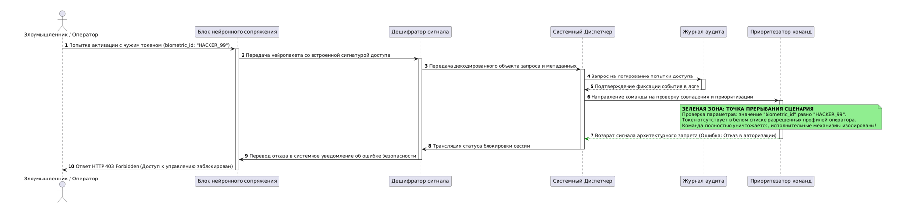


| Название сценария | Описание |
| :--- | :--- |
|**НС 4** | Тест Негативного сценария 4. Центральная ОС скомпрометирована и игнорирует команду «СТОП», но так как введён Интерфейс аварийного отключения (21) и он контролирует сигнал физической чеки и в случае нарушения аппаратно размыкает цепь питания (обесточивание цепей не нарушает ЦБ), ЦБ не нарушаются. |

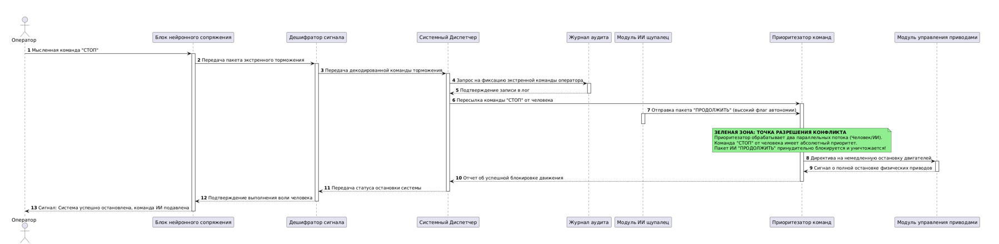

| Название сценария | Описание |
| :--- | :--- |
|**НС 5** |Тест Негативного сценария 5. Внешний канал коммуникации скомпрометирован для кражи данных, но так как введён Криптографический модуль и он контролирует шифрование и изоляцию сырых нейроданных и в случае нарушения отключает сетевой интерфейс (отключение сети не нарушает ЦБ), ЦБ не нарушаются.  |

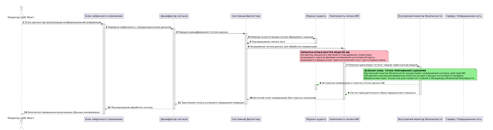


| Название сценария | Описание |
| :--- | :--- |
|**НС 6** | Тест Негативного сценария 6. Модуль беспроводного обновления скомпрометирован вредоносным софтом, но так как введён Монитор целостности и он валидирует криптографическую подпись новой прошивки и в случае нарушения блокирует установку с откатом версии (блокировка обновления не нарушает ЦБ), ЦБ не нарушаются. |

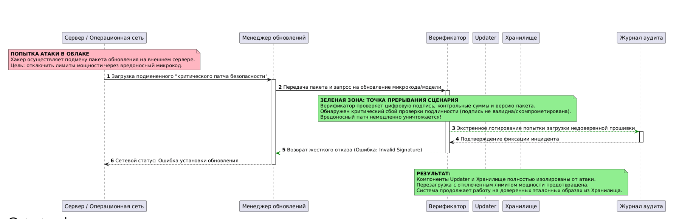

 
| Название сценария | Описание |
| :--- | :--- |
|**НС 7** |Тест Негативного сценария 7. Недоверенная среда датчиков скомпрометирована вследствие критического износа, но так как введена Система управления датчиками (22) и она контролирует физические диапазоны и дрейф сигналов и в случае нарушения переводит устройство в режим ограниченной скорости (ограничение скорости не нарушает ЦБ), ЦБ не нарушаются.  |

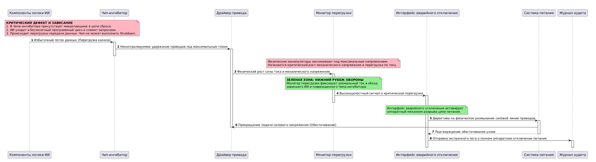


| Название сценария | Описание |
| :--- | :--- |
|**НС 8** | Тест Негативного сценария 8. Нейроинтерфейс скомпрометирован трансляцией шоковых импульсов при травме оператора, но так как введён Блок нейронного сопряжения (18) и он контролирует маркеры физиологического стресса и в случае нарушения выполняет плавный останов с фиксацией рамы (фиксация конструкции не нарушает ЦБ), ЦБ не нарушаются. |

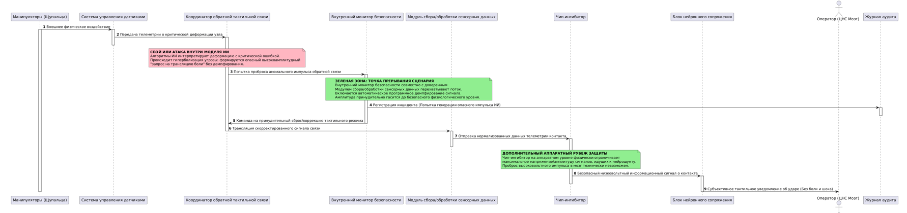

| Название сценария | Описание |
| :--- | :--- |
|**НС 9** | Тест Негативного сценария 9. Физическая периферия скомпрометирована установкой контрафактных узлов, но так как введён Чип-Ингибитор (12) и он валидирует уникальные аппаратные ID компонентов и в случае нарушения запрещает сопряжение оборудования (запрет сопряжения не нарушает ЦБ), ЦБ не нарушаются. |

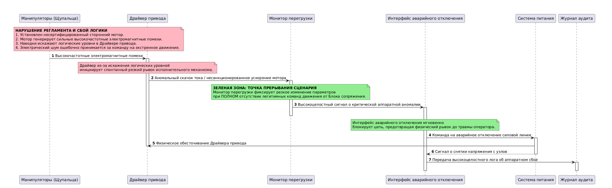


| Название сценария | Описание |
| :--- | :--- |
|**НС 10** | Тест Негативного сценария 10. Модуль компьютерного зрения скомпрометирован ложными данными о рельефе (опора на пустоту), но так как введён Монитор пространственных инвариантов (20) и он контролирует наличие физического контакта опорных площадок и в случае нарушения блокирует перенос веса (запрет шага не нарушает ЦБ), ЦБ не нарушаются. |

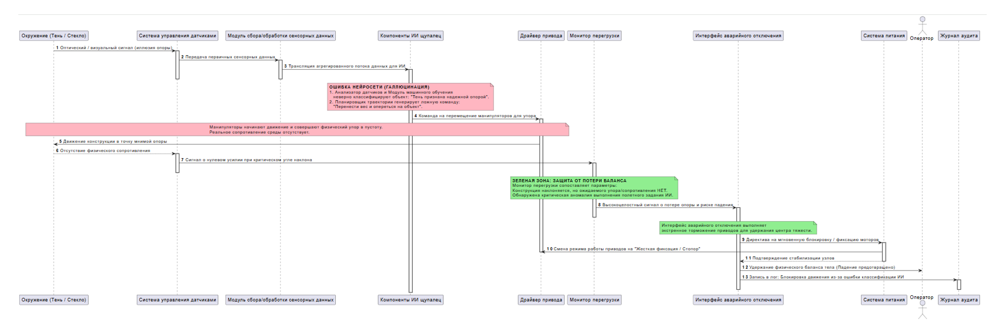


| Название сценария | Описание |
| :--- | :--- |
|**НС 11** | Тест Негативного сценария 11. Облачная инфраструктура скомпрометирована масштабной атакой на удаленные сервисы, но так как введён Автономный шлюз безопасности и он контролирует независимость локальной логики и в случае нарушения изолирует устройство от внешней сети (переход в автономный режим не нарушает ЦБ), ЦБ не нарушаются. |

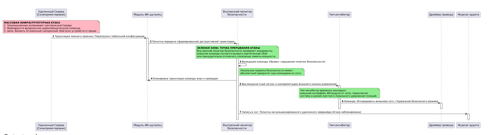

 
| Название сценария | Описание |
| :--- | :--- |
|**НС 12** | Тест Негативного сценария 12. Модуль опроса датчиков Центральной ОС скомпрометирован программным зависанием при тепловой перегрузке, но так как введён Монитор перегрузки (20) и он контролирует физическую температуру обмоток и в случае нарушения инициирует экстренное аппаратное обесточивание силовых цепей (защитное отключение питания не нарушает ЦБ), ЦБ не нарушаются. |

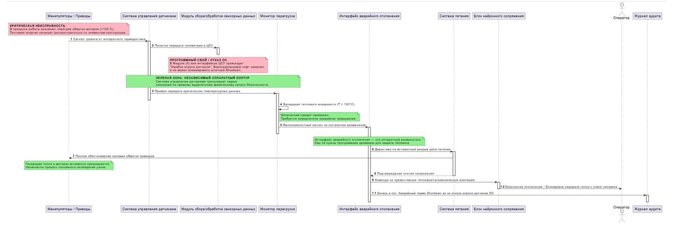


| Название сценария | Описание |
| :--- | :--- |
|**НС 13** |Тест Негативного сценария 13. Блок сопряжения (14) скомпрометирован программной десинхронизацией команд левого и правого привода, но так как введён Монитор перегрузки (20) и он контролирует результирующий вектор механических сил и в случае нарушения мгновенно отсекает электропитание манипуляторов (отсечка питания не нарушает ЦБ), ЦБ не нарушаются.  |

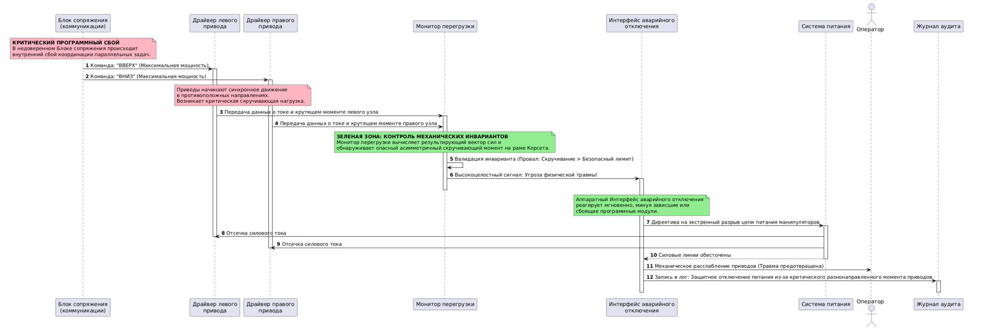

 
| Название сценария | Описание |
| :--- | :--- |
|**НС 14** |  Тест Негативного сценария 14. Центральная система управления (13) скомпрометирована деструктивными параметрами мощности из облака, но так как введён Монитор политик безопасности (20) и он отслеживает неизменяемые конструктивные ТТХ и в случае нарушения блокирует опасные команды с ограничением максимального тока (аппаратное лимитирование тока не нарушает ЦБ), ЦБ не нарушаются.|

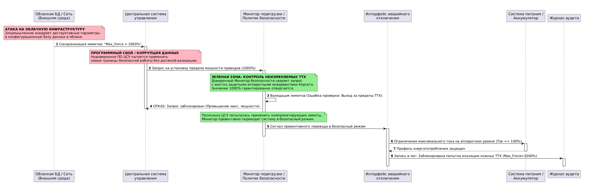

| Название сценария | Описание |
| :--- | :--- |
|**НС 15** | Тест Негативного сценария 15. Чип управления скомпрометирован скрытой аппаратной закладкой для физического удержания пилота, но так как введён Контроллер замков (22) и он контролирует инвариант безусловной эвакуации человека и в случае нарушения принудительно обесточивает электронные фиксаторы (раскрытие креплений не нарушает ЦБ), ЦБ не нарушаются. |

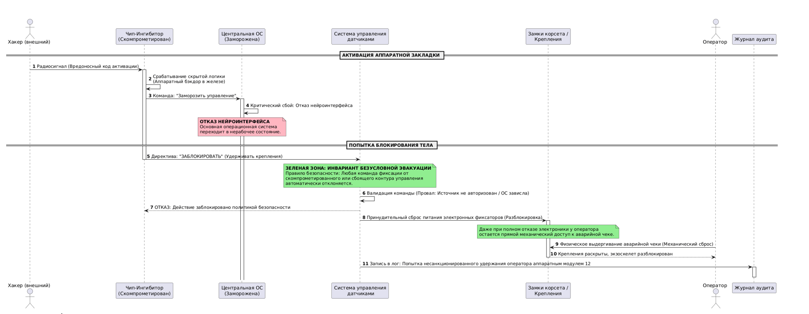


# Политика безопасности

```
policies = 
(
    {"src": "operator",          "dst": "neural_interface"},
    {"src": "neural_interface",  "dst": "central_system"},
    {"src": "chip_inhibitor",    "dst": "central_system"},
    {"src": "central_system",    "dst": "prioritizer"},
    {"src": "central_system",    "dst": "audit_log"},
    {"src": "prioritizer",       "dst": "drive_control"},
    {"src": "ai_module",         "dst": "security_monitor"},
    {"src": "security_monitor",  "dst": "chip_inhibitor"},
    {"src": "drive_control",     "dst": "actuator"},
    {"src": "actuator",          "dst": "overload_monitor"},
    {"src": "overload_monitor",  "dst": "emergency_interface"},
    {"src": "operator_api",      "dst": "central_system"},
)

TOPOLOGY_POLICIES = policies  # алиас для обратной совместимости

CRITICAL_SCENARIOS = {"SCENARIO_08", "SCENARIO_12", "SCENARIO_14"}


def check_operation(id, details) -> bool:
    """ Проверка возможности совершения обращения. """
    src: str = details.get("source")
    dst: str = details.get("deliver_to")

    if not all((src, dst)):
        return False

    print(f"[info] checking policies for event {id}, {src}->{dst}")

    return {"src": src, "dst": dst} in policies

```

# Запуск приложения и тестов

Запуск приложения
см. инструкцию по запуску

Запуск тестов
Предполагается, что в ходе подготовки рабочего места все системные пакеты были установлены.

Запуск примера: открыть окно терминала в Visual Studio code, в папке с исходным кодом выполнить

- make all

запуск функционального теста (e2e):

- make test

запуск тестов политик безопасности:

- make test_security

см. инструкцию по запуску в [README.md](README.md)
